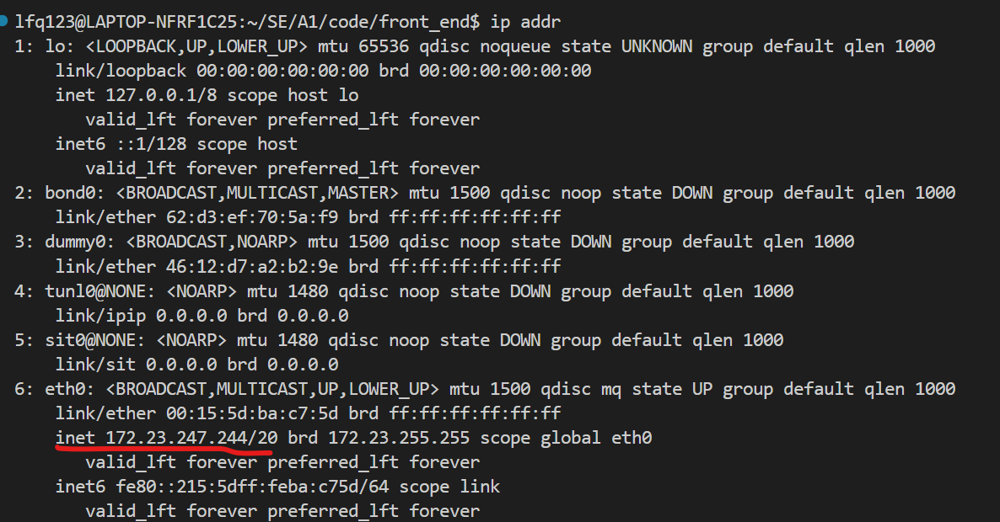

# front_end

## 如何运行这些代码？

在linux系统中运行。

确保你已经安装好了最新版本的node.js。

确保后端服务已开启。

- 有时候，林方芊会在她电脑上开启后端服务，这个时候，你直接找她要IP地址，她会发你。你在```./src/axios.js```文件的对应位置填入这个IP即可。
- 如果她没开服务，或者你想用自己的服务，那就需要你在自己电脑上开服务端。这个时候，需要用你电脑的WSL IP地址。打开Ubuntu终端，输入```ip addr```，获取本机的WSL IP地址，如下图所示。访问后端的时候，记得都要用这个绝对IP地址访问。每次重启电脑后，IP地址都会变，所以每次都要重新获取一次。获取IP地址后填在```./src/axios.js```文件的对应位置。当然，如果你想在自己电脑上跑服务端，你得确保你配好了后端环境、配置了数据库等等。

然后运行以下指令：

```sh
npm install
npm run dev
```

npm下载东西速度比较慢，要耐心等待。网上有些教程会建议你下载cnpm以达到更快的下载速度，但是我怕这样有兼容性问题所以还是用了npm。

官方步骤里还有这个指令：

```sh
npm run build
```

我还没用过，不知道有啥用。

## 目录结构

```assets```中是一些静态资源，如logo、图片
